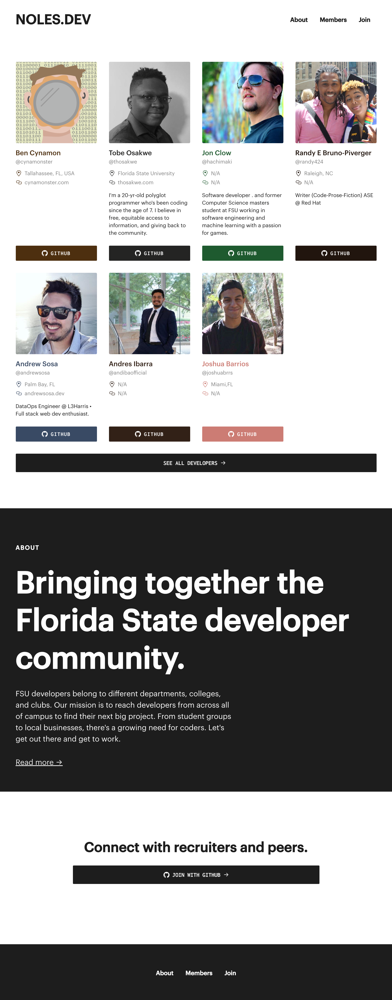

  

<h1 align="center">
  NOLES.DEV
</h1>

### noles.dev is retired.

Why though?

The original goal was to help FSU students (hence noles.dev) get discovered by their employers and peers. However, nobody is looking at this site, and if nobody is looking at it, nobody is using it.

This site operates under voluntary enrollement. The original inspiration for this site, [womenwho.design](https://womenwho.design), operated on a nomination system. However, I did not feel it was ethical to scrape Github profiles without user consent, or figure out who was an FSU student from those scraped profiles.

And so, we're putting noles.dev to bed. It was an excellent learning experience for React, Gatsby, Netlify, and AWS. You can find a screencap of the original site below, and naturally, the source is here on Github.

Cheers,

Andrew

